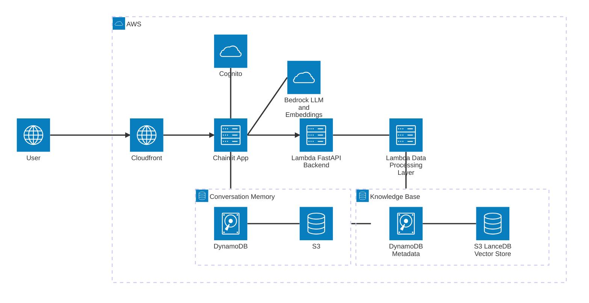

# 🏗️ RAG Builder

[](https://github.com/gontzalm/rag-builder/actions/workflows/ci.yml)

[](https://github.com/gontzalm/rag-builder/blob/main/LICENSE)

---

> RAG Builder is a well-architected, scalable, and secure RAG
> (Retrieval-Augmented Generation) application built on AWS. It allows users to
> create a knowledge base from PDFs and websites and then ask questions about
> it. The project is built with Python, AWS CDK, and LangChain, and it serves as
> a powerful demonstration of how to build production-ready GenAI applications
> on AWS.

## 🎥 Demo

https://github.com/user-attachments/assets/fc024d19-2359-4a75-8e80-1e1e06738bff

## 🏛️ Architecture

The application is built using a serverless-first architecture on AWS, designed
for scalability, security, and maintainability.



### Key Components

- **Frontend:** A [Chainlit](https://docs.chainlit.io/get-started/overview)
  application running on an AWS Fargate container. It is fronted by an
  Application Load Balancer and a CloudFront distribution to provide HTTPS and
  low-latency content delivery.

- **Authentication:** [Amazon Cognito](https://aws.amazon.com/cognito/) is used
  for user authentication and authorization, securing the application and its
  data.

- **Backend API:** A [FastAPI](https://fastapi.tiangolo.com/) application
  running on a Lambda function and exposed via API Gateway. It provides a
  RESTful API for managing documents and the knowledge base.

- **Document Processing:**
  - Document loading and deletion are handled asynchronously using Amazon SQS
    queues, which makes the application more resilient and responsive.
  - A Lambda function is triggered by the queue to download, chunk, create
    embeddings for, and store documents in the vector store.
  - The vector store is built with [LanceDB](https://lancedb.github.io/lancedb/)
    and stored on Amazon S3, providing a serverless and scalable solution for
    vector search.

- **AI Models:** The application uses
  [Amazon Bedrock](https://aws.amazon.com/bedrock/) for both the embeddings
  model (`amazon.titan-embed-text-v2:0`) and the agent's language model
  (`amazon.nova-pro-v1:0`).

- **Database:** [Amazon DynamoDB](https://aws.amazon.com/dynamodb/) is used to
  store document metadata and Chainlit conversation history.

- **Scheduled Tasks:** A weekly scheduled Lambda function, triggered by
  [Amazon EventBridge Scheduler](https://aws.amazon.com/eventbridge/scheduler/),
  optimizes the LanceDB vector store to maintain performance.

  Optimization covers three operations:
  - _Compaction_: Merges small files into larger ones
  - _Prune_: Removes old versions of the dataset
  - _Index_: Optimizes the indices, adding new data to existing indices
    (incremental indexing)

### RAG Search Implementation

The RAG agent employs a hybrid search strategy to retrieve relevant context from
the LanceDB vector store. This approach combines:

- **Vector Search:** Retrieves documents based on semantic similarity using
  embeddings generated by Amazon Bedrock.
- **Keyword Search:** Matches specific terms using full-text search.
- **Reranking:** Uses Reciprocal Rank Fusion (RRF) to combine and order the
  results from both search methods.

This ensures a robust retrieval process that captures both conceptually similar
content and exact keyword matches.

## (TODO: add emoji) Evaluation Module

TODO: add intro to evaluation module.


### `create-kb`


### `generate-testset`


### `run-experiment`


### `visualize-experiments`


TODO: add dashboard output


## ⚙️ CI/CD

This project implements a production-grade CI/CD pipeline using **GitHub
Actions**, focusing on speed, security, and developer feedback.

### Continuous Integration (CI)

> Triggered on: **Pull Requests to `main`**

- **Efficient Dependency Management:** Uses `uv` to install Python dependencies
  at lightning speeds, significantly reducing CI build times compared to `pip`
  or `poetry`.
- **Smart Monorepo Testing:** Implements `dorny/paths-filter` to only run tests
  for components that have changed (e.g., if only the Backend API is modified,
  only those tests run), saving compute resources.
- **Automated Feedback:** Posts detailed **Test Coverage Reports** directly to
  Pull Requests as comments, ensuring code quality visibility before merging.
- **Isolated Environments:** Runs unit tests for each Lambda function in
  isolated environments to prevent dependency conflicts.

### Continuous Deployment (CD)

> Triggered on: **Push to `main`** (after CI passes and PR is merged)

- **Secure Authentication:** Uses **OpenID Connect (OIDC)** to authenticate with
  AWS, eliminating the need for long-lived Access Keys in GitHub Secrets.
- **Infrastructure as Code:** Automatically deploys infrastructure changes via
  AWS CDK.
- **Concurrency Control:** Prevents race conditions by ensuring only one
  deployment pipeline runs at a time for the production environment.

## 🚀 Getting Started

### Prerequisites

- An AWS account
- [AWS CLI](https://aws.amazon.com/cli/) configured with your credentials and
  appropriate permissions
- Python 3.12+
- [uv](https://github.com/astral-sh/uv) installed

### Deployment to AWS

1.  Clone the repository

    ```bash
    git clone https://github.com/gontzalm/rag-builder.git
    cd rag-builder
    ```

1.  Install dependencies

    ```bash
    uv sync
    ```

1.  Bootstrap the CDK environment (if you haven't already)

    ```bash
    cdk bootstrap
    ```

1.  Deploy the stack

    ```bash
    cdk deploy
    ```

    The deployment will take several minutes. Once it's complete, the CDK will
    output the URL of the Chainlit application and a `.env` file for local
    testing.

    **Tip:** To save costs, speed up deployments, or if you're developing the
    Chainlit UI locally, you can disable its deployment (Fargate service, Load
    Balancer, and CloudFront distribution) by using the `deploy_chainlit`
    context value:

    ```bash
    cdk deploy -c deploy_chainlit=false
    ```

### Local Development and Testing

For a faster development cycle, you can run the Chainlit application locally
while connecting to the deployed AWS resources.

1.  After deploying the stack, copy the `.env` file content from the CDK output.

1.  Create a file named `.env` in the `rag_builder/fargate/chainlit-app/`
    directory and paste the content into it.

1.  Navigate to the Chainlit app directory:

    ```bash
    cd rag_builder/fargate/chainlit-app
    ```

1.  Install the local dependencies:

    ```bash
    uv sync
    ```

1.  Run the Chainlit application:

    ```bash
    uv run chainlit run main.py -w

    ```

    This will start a local server, and you can access the application at
    `http://localhost:8000`.

## 🛠️ Technology Stack

| Category                   | Technology                                                                                                                                                                                                                                                                                                                                                                                                                        |
| -------------------------- | --------------------------------------------------------------------------------------------------------------------------------------------------------------------------------------------------------------------------------------------------------------------------------------------------------------------------------------------------------------------------------------------------------------------------------- |
| **Infrastructure as Code** | [](https://aws.amazon.com/cdk/)                                                                                                                                                                                                                                                                                            |
| **Frontend**               | [](https://docs.chainlit.io/get-started/overview)                                                                                                                                                                                                                                                                                   |
| **Backend**                | [](https://fastapi.tiangolo.com)                                                                                                                                                                                                                                                                                      |
| **GenAI**                  | [](https://www.langchain.com/) [](https://aws.amazon.com/bedrock/) [](https://lancedb.com/) |
| **Package Management**     | [](https://docs.astral.sh/uv/)                                                                                                                                                                                                                                                                                                       |
