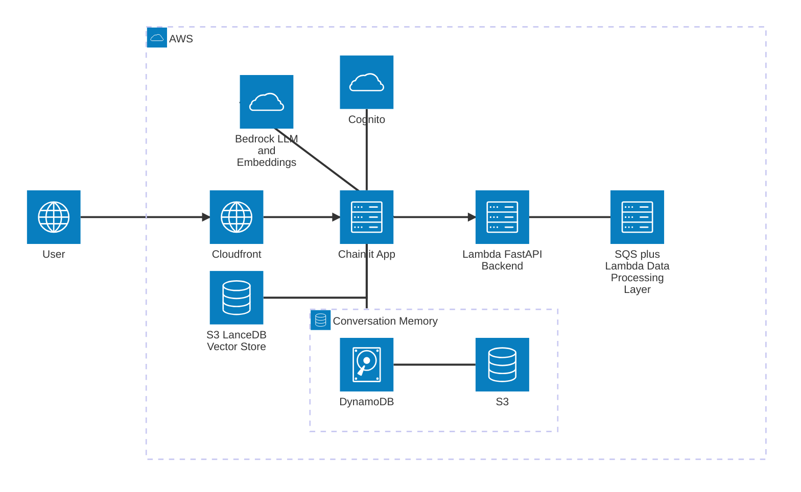

# RAG Builder

RAG Builder is a well-architected, scalable, and secure RAG (Retrieval-Augmented
Generation) application built on AWS. It allows users to create a knowledge base
from PDFs and websites and then ask questions about it. The project is built
with Python, AWS CDK, and LangChain, and it serves as a powerful demonstration
of how to build production-ready GenAI applications on AWS.

## Architecture

The application is built using a serverless-first architecture on AWS, designed
for scalability, security, and maintainability.



### Key Components

- **Frontend:** A [Chainlit](https://docs.chainlit.io/get-started/overview)
  application running on an AWS Fargate container. It is fronted by an
  Application Load Balancer and a CloudFront distribution to provide HTTPS and
  low-latency content delivery.

- **Authentication:** [Amazon Cognito](https://aws.amazon.com/cognito/) is used
  for user authentication and authorization, securing the application and its
  data.

- **Backend API:** A [FastAPI](https://fastapi.tiangolo.com/) application
  running on a Lambda function and exposed via API Gateway. It provides a
  RESTful API for managing documents and the knowledge base.

- **Document Processing:**
  - Document loading and deletion are handled asynchronously using Amazon SQS
    queues, which makes the application more resilient and responsive.
  - A Lambda function is triggered by the queue to download, chunk, create
    embeddings for, and store documents in the vector store.
  - The vector store is built with [LanceDB](https://lancedb.github.io/lancedb/)
    and stored on Amazon S3, providing a serverless and scalable solution for
    vector search.

- **AI Models:** The application uses
  [Amazon Bedrock](https://aws.amazon.com/bedrock/) for both the embeddings
  model (`amazon.titan-embed-text-v2:0`) and the agent's language model
  (`amazon.nova-pro-v1:0`).

- **Database:** [Amazon DynamoDB](https://aws.amazon.com/dynamodb/) is used to
  store document metadata and Chainlit conversation history.

- **Scheduled Tasks:** A weekly scheduled Lambda function, triggered by
  [Amazon EventBridge](https://aws.amazon.com/eventbridge/), optimizes the
  LanceDB vector store to maintain performance.

## Getting Started

### Prerequisites

- An AWS account
- [AWS CLI](https://aws.amazon.com/cli/) configured with your credentials and
  appropriate permissions
- Python 3.12+
- [uv](https://github.com/astral-sh/uv) installed

### Deployment to AWS

1.  **Clone the repository**

    ```bash
    git clone https://github.com/gontzalm/rag-builder.git
    cd rag-builder
    ```

1.  **Install dependencies**

    ```bash
    uv sync
    ```

1.  **Bootstrap the CDK environment (if you haven't already)**

    ```bash
    cdk bootstrap
    ```

1.  **Deploy the stack**

    ```bash
    cdk deploy
    ```

    The deployment will take several minutes. Once it's complete, the CDK will
    output the URL of the Chainlit application and a `.env` file for local
    testing.

### Local Development and Testing

For a faster development cycle, you can run the Chainlit application locally
while connecting to the deployed AWS resources.

1.  After deploying the stack, copy the `.env` file content from the CDK output.

1.  Create a file named `.env` in the `rag_builder/fargate/chainlit-app/`
    directory and paste the content into it.

1.  Navigate to the Chainlit app directory:

    ```bash
    cd rag_builder/fargate/chainlit-app
    ```

1.  Install the local dependencies:

    ```bash
    uv sync
    ```

1.  Run the Chainlit application:

    ```bash
    uv run chainlit run main.py -w

    ```

    This will start a local server, and you can access the application at
    `http://localhost:8000`.

## Technology Stack

- **Infrastructure as Code:** [AWS CDK](https://aws.amazon.com/cdk/)
- **Frontend:** [Chainlit](https://docs.chainlit.io/get-started/overview)
- **Backend:** [FastAPI](https://fastapi.tiangolo.com/)
- **AI/ML:** [LangChain](https://www.langchain.com/),
  [Amazon Bedrock](https://aws.amazon.com/bedrock/),
  [LanceDB](https://lancedb.github.io/lancedb/)
- **AWS Services:**
  - Amazon S3
  - Amazon DynamoDB
  - Amazon SQS
  - AWS Lambda
  - AWS Fargate
  - Amazon API Gateway
  - Amazon Cognito
  - Amazon CloudFront
  - Amazon EventBridge
- **Package Management:** [uv](https://github.com/astral-sh/uv)
